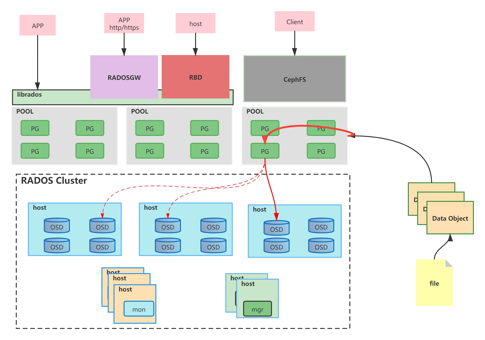
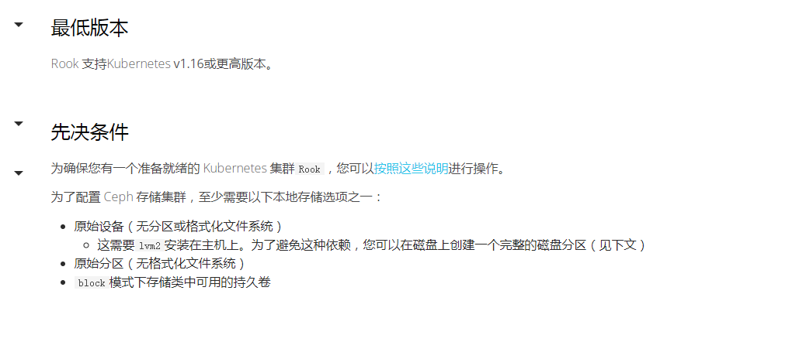
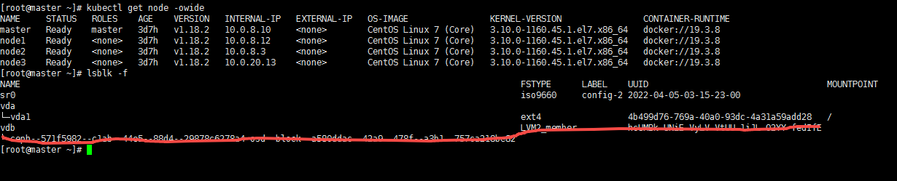

# 一、基础概念
## 1.基本介绍
* `Ceph uniquely delivers object, block, and file storage in one unified system.` Ceph是目前非常流行的**统一存储系统**，所谓统一存储系统，就是通过Ceph集群同时提供块**设备存储**、**对象存储**以及**文件系统服务**
  
## 2.Object: 
* `Object`是Ceph最底层的存储单元，大小可以自己定义通常为2M或4M,每个Object都包含了在集群范围内唯一的标识OID、二进制数据、以及由一组键值对组成的元数据。
## 3.POOL
* `POOL`是Ceph中的一些object的逻辑分组,Pool由若干个PG组成，其属性包括：所有者和访问权限、Object副本数目、**PG数目和CRUSH规则集合**等,Ceph中的Pool有两种类型
## 4.OSD
* `OSD`全称Object Storage Device，也就是负责响应客户端请求返回具体数据的进程。一个Ceph集群一般都有很多个OSD。
## 5.PG
* `PG`全称Placement Grouops，归置组，是一个逻辑的概念，一个PG包含多个OSD。引入PG这一层其实是为了更好的分配数据和定位数据
## 6.Monitor
* 一个Ceph集群需要多个`Monitor`组成的小集群，它们通过Paxos同步数据，用来保存OSD的元数据。也可是单个，但会有单点故障
## 7.RADOS
* `RADOS`全称Reliable Autonomic Distributed Object Store，是Ceph集群的精华，用户实现 数据分配、Failover等集群操作。
## 8.Libradio
* `Libradio`是Rados提供库，因为RADOS是协议很难直接访问，因此上层的RBD、RGW和CephFS都是通过librados访问的，目前提供PHP、Ruby、Java、Python、C和C++支持。
## 9.CRUSH
* `CRUSH`是Ceph使用的数据分布算法，类似一致性哈希，让数据分配到预期的地方。
## 10.RBD
* `RBD`全称RADOS block device，是Ceph对外提供的块设备服务。
## 11.RGW
* `RGW`全称RADOS gateway，是Ceph对外提供的对象存储服务，接口与S3和Swift兼容。
## 12.CephFS
* `CephFS`全称Ceph File System，是Ceph对外提供的文件系统服务。
## 13.MDS
* `MDS`: 全称Ceph Metadata Server，是CephFS服务依赖的元数据服务。
## 14.数据写入到最终落盘的两次映射
* hash(文件,pool)求模PG数量(节点宕机不会影响PG数量) -> PG, CRUSH(PG,集群拓扑,规则) -> PG(OSD0,OSD1,OSD2)(在创建存储池的时候关系就建立,PG MAP维护映射关系)
* 客户端获取mon维护的PG MAP
***
# 二、安装
## 1.环境准备
***

* 采用rook部署ceph集群前置条件 k8s 1.16+  至少一个节点有裸磁盘或裸分区或volumeMode=block的存储卷
* [rook官方文档](https://rook.io/)
***
 
* k8s集群采用一主三从 每一个节点都有一个vdb裸盘(一个节点可以有多个，也可以没有，至少保证一块裸盘)，红色部分是已经部署成功才有的状态
* 采用rook部署默认的ceph集群会默认自动发现所有节点的裸盘，与vdb名字无关，也可修改下面的yaml资源文件发现固定名称的裸盘
* 会在每一个节点启动一个osd的pod,master节点有污点无法调度,可以删除污点或修改下面的yaml支持osd污点容忍
***
## 2.安装
```shell
git clone --single-branch --branch v1.5.5 https://github.com/rook/rook.git #无法访问通过代理网站下载  git clone --single-branch --branch v1.5.5 https://hub.fastgit.xyz/rook/rook.git
kubectl apply -f rook/cluster/examples/kubernetes/ceph/common.yaml
kubectl apply -f rook/cluster/examples/kubernetes/ceph/crds.yaml
kubectl apply -f rook/cluster/examples/kubernetes/ceph/operator.yaml
kubectl apply -f rook/cluster/examples/kubernetes/ceph/cluster.yaml
```
## 3.检查ceph集群状态
* 通过 `kubectl get pod -n rook-ceph -owide` 发现部分pod镜像拉取失败（在`rook/cluster/examples/kubernetes/ceph/operator.yaml`）
* 更改`operator.yaml`的镜像名中为阿里云的镜像名可解决，这里使用另一种方法,从阿里云下载镜像再改名为google的镜像名
* 下面是镜像拉取脚本,需要在每一个节点执行
```shell
#! /bin/bash 

 image_list=(
	csi-node-driver-registrar:v2.0.1
	csi-attacher:v3.0.0
	csi-snapshotter:v3.0.0
	csi-resizer:v1.0.0
	csi-provisioner:v2.0.0
)
aliyuncs="registry.aliyuncs.com/it00021hot"
google_gcr="k8s.gcr.io/sig-storage"
for image in ${image_list[*]}
do
	docker pull $aliyuncs/$image
	docker tag  $aliyuncs/$image $google_gcr/$image
	docker rm   $aliyuncs/$image
	echo "$aliyuncs/$image $google_gcr/$image downloaded."
done
```
## 4.宿主机安装命令行工具
* `kubectl apply -f rook/cluster/examples/kubernetes/ceph/toolbox.yaml` 部署客户端pod,进入该容器可执行`ceph -s`查询ceph集群状态
* 将容器中`/etc/ceph/ceph.conf` `/etc/ceph/keyring` 复制到宿主机相同目录下,配置信息也可应该可从前面部署的yaml文件中找
* 在宿主机安装命令行工具,先设置yum源
```shell
tee /etc/yum.repos.d/ceph.repo <<-'EOF'
[Ceph]
name=Ceph packages for $basearch
baseurl=http://mirrors.163.com/ceph/rpm-jewel/el7/$basearch
enabled=1
gpgcheck=0
type=rpm-md
gpgkey=https://mirrors.163.com/ceph/keys/release.asc
priority=1
[Ceph-noarch]
name=Ceph noarch packages
baseurl=http://mirrors.163.com/ceph/rpm-jewel/el7/noarch
enabled=1
gpgcheck=0
type=rpm-md
gpgkey=https://mirrors.163.com/ceph/keys/release.asc
priority=1
[ceph-source]
name=Ceph source packages
baseurl=http://mirrors.163.com/ceph/rpm-jewel/el7/SRPMS
enabled=1
gpgcheck=0
type=rpm-md
gpgkey=https://mirrors.163.com/ceph/keys/release.asc
priority=1
EOF
```
* `yum -y install ceph-common` 安装成功后执行`ceph -s`查看ceph集群状态
***
# 三、存储池的相关操作
## 1.创建存储池：`ceph osd pool create pool_name pg_num [pgp_num] [replicated] [crush-ruleset-name] [expected-num-objects]`,例如：`ceph osd pool create test1 128 128`
* `pool_name`:池的名字
* `pg_num`pg的数量
* `pgp_num`:pgp的数量，池的pg有效数，通常与pg总数相等
* `replicated`:复制池(默认)
* `crush-ruleset-name`:应用于crush规则的名称，不指定则采取默认的规则，为`osd_pool_default_crush_replicated_ruleset`，可通过`ceph osd crush dump`查看
* `expected-num-objects`:池中预期的对象数量，如果事先知道这个值，ceph可在创建池时在OSD的XFS系统上准备文件夹结构
否则ceph会在对象数量增加时重组这个结构，重组会带来延迟影响
***
## 2.查看存储池
* `ceph osd lspools`或`ceph osd pool ls`,查看已有的存储池
* `ceph osd pool ls detail`或`ceph osd pool stats pool_name `,查看存储池详情
* `ceph df` 池的使用量统计
***
## 3.为存储池启用ceph应用类型
* `ceph osd pool application enable pool_name type`，type可为`rbd`,`rgw`,`cephfs`
``` shell
[root@master ~]# ceph osd pool application enable test1 rbd
enabled application 'rbd' on pool 'test1'
```
## 4.重命名池
* `ceph osd pool rename test1 test11`
``` shell
[root@master ~]# ceph osd pool rename test1 test11
pool 'test1' renamed to 'test11'
```
## 5.设置存储池配额，当达到配额时，操作会被无限期阻止，与ceph存储集群已满时一致
* `ceph osd pool set-quota pool_name max_objects counts`,设置存储池最大对象数
``` shell
[root@master ~]# ceph osd pool set-quota test11 max_objects 10000
set-quota max_objects = 10000 for pool test11
```
* `ceph osd pool set-quota pool_name max_bytes bytes`,设置存储池最大字节数
``` shell
[root@master ~]# ceph osd pool set-quota test11 max_bytes 102400
set-quota max_bytes = 102400 for pool test11
```
***
## 6.存储池快照
* `ceph osd pool mksnap pool_name snap_name`,创建存储池的快照
``` shell
[root@master ~]# ceph osd pool mksnap test11 test11-snap01
created pool test11 snap test11-snap01
```
``` shell
[root@master ~]# ceph osd pool ls  detail
pool 1 'device_health_metrics' replicated size 3 min_size 2 crush_rule 0 object_hash rjenkins pg_num 1 pgp_num 1 autoscale_mode on last_change 22 flags hashpspool stripe_width 0 pg_num_min 1 application mgr_devicehealth
pool 4 'test11' replicated size 3 min_size 2 crush_rule 0 object_hash rjenkins pg_num 32 pgp_num 32 autoscale_mode on last_change 1689 lfor 0/1224/1222 flags hashpspool,pool_snaps max_bytes 102400 max_objects 10000 stripe_width 0 application rbd
	snap 1 'test11-snap01' 2022-06-11T17:49:54.851555+0000
```
* `ceph osd pool rmsnap pool_name snap_name`,删除存储池快照
``` shell
[root@master ~]# ceph osd pool rmsnap test11 test11-snap01
removed pool test11 snap test11-snap01
```
* `rados -p pool_name -s snap_name get object test.yaml`
``` shell
[root@master ~]# rados -p test11 -s test11-snap01 get object test.yaml ##池中没有文件或目录报错
selected snap 3 'test11-snap01'
error getting test11/object: (2) No such file or directory
```
***
## 7.存储池的参数
* `ceph osd pool get pool_name all`,查看存储池的参数(规则配置)，`size`、`pg_bum`和`crush_rule`是最重要的规则
``` shell
[root@master ~]# ceph osd  pool get test11 all
size: 3
min_size: 2
pg_num: 32
pgp_num: 32
crush_rule: replicated_rule
hashpspool: true
nodelete: false
nopgchange: false
nosizechange: false
write_fadvise_dontneed: false
noscrub: false
nodeep-scrub: false
use_gmt_hitset: 1
fast_read: 0
pg_autoscale_mode: on
```
* `ceph osd pool set pool_name param value`,设置存储池的参数(规则配置)
``` shell
[root@master ~]# ceph osd pool set test11 size 1 ##副本数设置为1
set pool 4 size to 1
```
***
## 8.删除存储池
* `ceph osd pool delete pool_name pool_name  --yes-i-really-really-mean-it`,存储池的名字要写两遍
``` shell
[root@master ~]# ceph osd pool delete test2 test2  --yes-i-really-really-mean-it
pool 'test2' removed
```
***
# 命令汇总
***
* `ceph osd ls`,查看所有osd
``` shell
[root@master ~]# ceph osd ls
0
1
2
3
```
***
* `ceph osd stat`,查看osd状态
``` shell
[root@master ~]# ceph osd stat
4 osds: 4 up (since 47h), 4 in (since 47h); epoch: e1699
```
***
* `ceph osd tree`,查看osd树形结构
``` shell
[root@master ~]# ceph osd tree
ID  CLASS  WEIGHT   TYPE NAME        STATUS  REWEIGHT  PRI-AFF
-1         0.03918  root default                              
-7         0.00980      host master                           
 1    hdd  0.00980          osd.1        up   1.00000  1.00000
-3         0.00980      host node1                            
 0    hdd  0.00980          osd.0        up   1.00000  1.00000
-5         0.00980      host node2                            
 2    hdd  0.00980          osd.2        up   1.00000  1.00000
-9         0.00980      host node3                            
 3    hdd  0.00980          osd.3        up   1.00000  1.00000
```
***
* `ceph osd dump`,导出osd详细信息
``` shell
[root@master ~]# ceph osd dump
epoch 1699
fsid 2ceb7b6b-78a0-40cc-8a2f-abd695c70914
created 2022-06-10T16:48:19.983619+0000
modified 2022-06-12T15:23:03.169874+0000
flags sortbitwise,recovery_deletes,purged_snapdirs,pglog_hardlimit
crush_version 7
full_ratio 0.95
backfillfull_ratio 0.9
nearfull_ratio 0.85
require_min_compat_client luminous
min_compat_client jewel
require_osd_release octopus
pool 1 'device_health_metrics' replicated size 3 min_size 2 crush_rule 0 object_hash rjenkins pg_num 1 pgp_num 1 autoscale_mode on last_change 22 flags hashpspool stripe_width 0 pg_num_min 1 application mgr_devicehealth
pool 4 'test11' replicated size 2 min_size 1 crush_rule 0 object_hash rjenkins pg_num 32 pgp_num 32 autoscale_mode on last_change 1695 lfor 0/1224/1222 flags hashpspool,pool_snaps max_bytes 102400 max_objects 10000 stripe_width 0 application rbd
	snap 3 'test11-snap01' 2022-06-11T17:56:30.251872+0000
max_osd 4
osd.0 up   in  weight 1 up_from 9 up_thru 1695 down_at 0 last_clean_interval [0,0) [v2:10.244.2.236:6800/118535083,v1:10.244.2.236:6801/118535083] [v2:10.244.2.236:6802/118535083,v1:10.244.2.236:6803/118535083] exists,up affad9fa-2e9b-4a51-86a6-25623489d826
osd.1 up   in  weight 1 up_from 12 up_thru 1695 down_at 0 last_clean_interval [0,0) [v2:10.244.0.200:6800/2167737203,v1:10.244.0.200:6801/2167737203] [v2:10.244.0.200:6802/2167737203,v1:10.244.0.200:6803/2167737203] exists,up 94d2bece-d6ca-4209-8fdf-b0e76e396da5
osd.2 up   in  weight 1 up_from 12 up_thru 1695 down_at 0 last_clean_interval [0,0) [v2:10.244.1.178:6800/3465597621,v1:10.244.1.178:6801/3465597621] [v2:10.244.1.178:6802/3465597621,v1:10.244.1.178:6803/3465597621] exists,up 24da08d8-973b-4de8-9735-fac864f1d5ed
osd.3 up   in  weight 1 up_from 17 up_thru 1695 down_at 0 last_clean_interval [0,0) [v2:10.244.3.47:6800/1888772417,v1:10.244.3.47:6801/1888772417] [v2:10.244.3.47:6802/1888772417,v1:10.244.3.47:6803/1888772417] exists,up 3b4fcd7b-533b-40a5-ab05-a61e0c2b8492
```
***
* `ceph mon stat`,查看Monitor状态
``` shell
[root@master ~]# ceph mon stat
e1: 1 mons at {a=[v2:10.100.154.12:3300/0,v1:10.100.154.12:6789/0]}, election epoch 3, leader 0 a, quorum 0 a
```
***
* `ceph mon dump`,导出Monitor详细信息
``` shell
[root@master ~]# ceph mon dump
dumped monmap epoch 1
epoch 1
fsid 2ceb7b6b-78a0-40cc-8a2f-abd695c70914
last_changed 2022-06-10T16:48:19.048859+0000
created 2022-06-10T16:48:19.048859+0000
min_mon_release 15 (octopus)
0: [v2:10.100.154.12:3300/0,v1:10.100.154.12:6789/0] mon.a
```
***
* `ceph pg dump`,导出PG详细信息
***
* `ceph osd crush dump`,导出CRUSH详细信息
***
* `ceph -s`或`ceph status`,查看ceph集群的状态
``` shell
[root@master ~]# ceph -s
  cluster:
    id:     2ceb7b6b-78a0-40cc-8a2f-abd695c70914
    health: HEALTH_OK
 
  services:
    mon: 1 daemons, quorum a (age 47h)
    mgr: a(active, since 47h)
    osd: 4 osds: 4 up (since 47h), 4 in (since 47h)
 
  data:
    pools:   2 pools, 33 pgs
    objects: 0 objects, 0 B
    usage:   4.5 GiB used, 36 GiB / 40 GiB avail
    pgs:     33 active+clean
```
